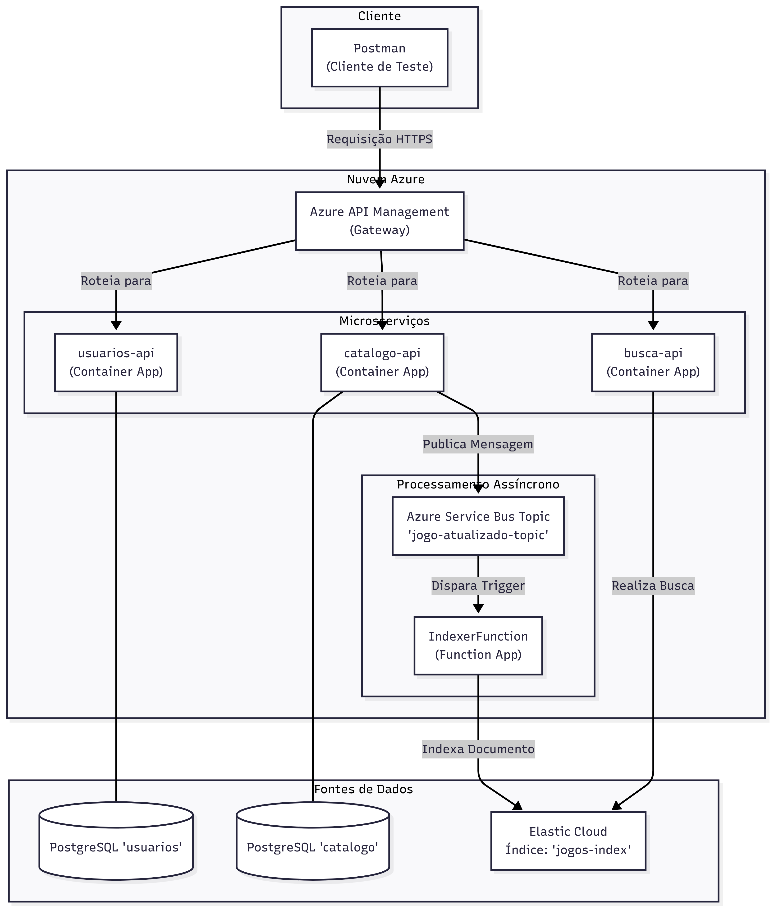
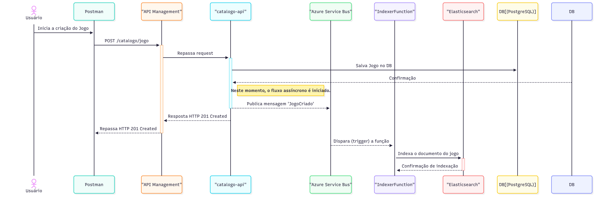

# Arquitetura do Projeto - FIAP Cloud Games (Fase 3)

## Visão Geral do Projeto

Este repositório centraliza a documentação da arquitetura de microsserviços do projeto **FIAP Cloud Games**, desenvolvido como parte do Tech Challenge da Pós-Graduação em Arquitetura de Sistemas .NET com Azure da FIAP.

O objetivo desta fase foi refatorar a aplicação monolítica original (desenvolvida nas Fases 1 e 2) em uma arquitetura distribuída, moderna e escalável, aplicando conceitos de Domain-Driven Design (DDD), mensageria, serverless e busca avançada.

---

### Principais Tecnologias Utilizadas

-   **Plataforma:** .NET 8, C#
-   **Cloud:** Microsoft Azure
-   **Hospedagem:** Azure Container Apps & Azure Functions
-   **Mensageria:** Azure Service Bus
-   **API Gateway:** Azure API Management (APIM)
-   **Banco de Dados:** PostgreSQL (hospedado no Railway)
-   **Motor de Busca:** Elasticsearch (hospedado no Elastic Cloud)
-   **CI/CD:** Azure DevOps Pipelines
-   **Conteinerização:** Docker
-   **Observabilidade:** New Relic

---

### Diagrama de Arquitetura

O diagrama abaixo ilustra a visão macro de todos os componentes do sistema e como eles se interconectam, desde o ponto de entrada único no API Gateway até os bancos de dados e serviços de backend.

---

### Diagrama de Fluxo (Exemplo: Criação de Jogo)

Para detalhar a interação entre os serviços, o diagrama de sequência a seguir mostra o fluxo completo de uma requisição para criar um novo jogo. Ele evidencia a separação entre a resposta síncrona para o usuário e o processamento assíncrono para a indexação da busca.

---

### Repositórios dos Componentes

O código-fonte de cada componente da arquitetura está desacoplado em seu próprio repositório, seguindo as melhores práticas de microsserviços.

| Repositório                                                                                | Responsabilidade                                                                                             |
| :----------------------------------------------------------------------------------------- | :----------------------------------------------------------------------------------------------------------- |
| **[arquitetura](https://github.com/thiagoreboredo/fiap-cloud-games-arquitetura)** | **(Este repositório)** Documentação central, diagramas e visão geral do projeto.                             |
| [**usuarios-api**](https://github.com/thiagoreboredo/fiap-cloud-games-usuarios-api)          | Microsserviço responsável pelo cadastro e autenticação de usuários (emite o token JWT).                      |
| [**catalogo-api**](https://github.com/thiagoreboredo/fiap-cloud-games-catalogo-api)          | Microsserviço que gerencia o CRUD de jogos e publica eventos de alteração no Service Bus.                    |
| [**busca-api**](https://github.com/thiagoreboredo/fiap-cloud-games-busca-api)                | Microsserviço que expõe a API de busca, consultando diretamente o Elasticsearch.                             |
| [**indexer-function**](https://github.com/thiagoreboredo/fiap-cloud-games-indexer-function) | Azure Function (Serverless) que consome os eventos do Service Bus e indexa os dados no Elasticsearch. |

---

### Integrantes do Grupo

-   Elias Oliveira Prates (RM364079)
-   William Henrique Cirino (RM361204)
-   Thiago Martins Reboredo (RM364884)