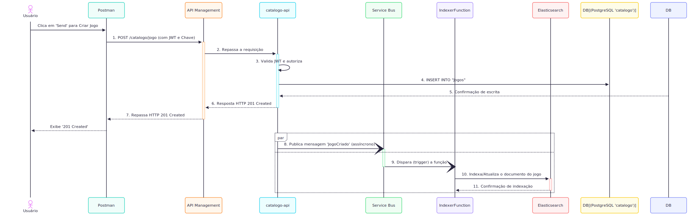

# Arquitetura do Projeto - FIAP Cloud Games (Fase 3)

Este repositório centraliza a documentação da arquitetura de microsserviços do projeto FIAP Cloud Games, desenvolvido para a Pós-Graduação em Arquitetura de Sistemas .NET com Azure.

O objetivo desta fase foi refatorar a aplicação monolítica original em uma arquitetura distribuída, utilizando Azure, Docker, mensageria e um motor de busca dedicado.

---

### Visão Geral da Arquitetura

O diagrama abaixo ilustra todos os componentes do sistema e como eles se interconectam, desde o ponto de entrada no API Gateway até os bancos de dados e serviços de backend.

---

### Fluxo de Comunicação (Exemplo: Criação de Jogo)

Para detalhar a interação entre os serviços, o diagrama de sequência a seguir mostra o fluxo completo de uma requisição para criar um novo jogo, incluindo a comunicação síncrona (API) e assíncrona (mensageria).

---

### Repositórios dos Microsserviços

O código-fonte de cada componente da arquitetura está dividido nos seguintes repositórios:

* **[fiap-cloud-games-usuarios-api](https://github.com/thiagoreboredo/fiap-cloud-games-usuarios-api):** Microsserviço responsável pelo cadastro e autenticação de usuários.
* **[fiap-cloud-games-catalogo-api](https://github.com/thiagoreboredo/fiap-cloud-games-catalogo-api):** Microsserviço que gerencia o CRUD de jogos e promoções.
* **[fiap-cloud-games-busca-api](https://github.com/thiagoreboredo/fiap-cloud-games-busca-api):** Microsserviço de busca que consulta os dados no Elasticsearch.
* **[fiap-cloud-games-indexer-function](https://github.com/thiagoreboredo/fiap-cloud-games-indexer-function):** Azure Function que processa eventos de atualização do catálogo e indexa os dados.